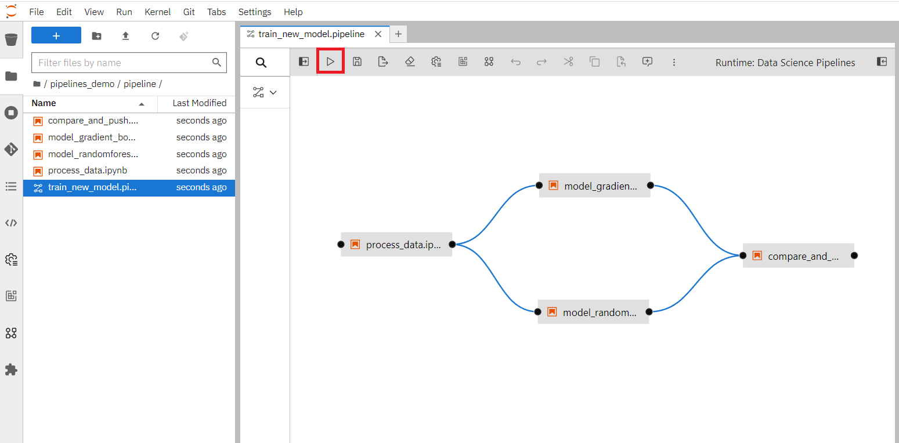
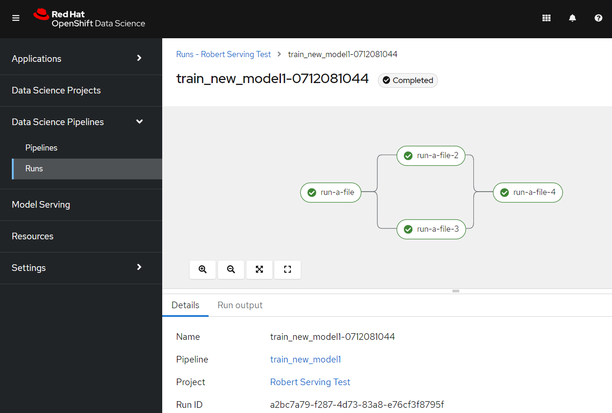
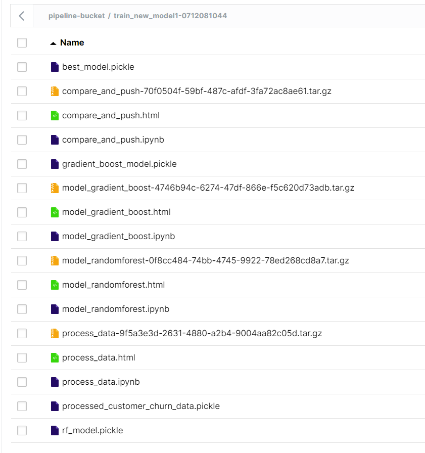

# OpenShift Data Science Pipelines demo

## How to use

Create a workbench with a custom notebook image that supports Elyra (Standard Data Science works well here).  
Enter the workspace and clone this repo.  
Open pipeline/train_new_model.pipeline and press "Run pipeline" in the top menu.  

  

You can keep track of the results in Data Science Pipelines -> Runs -> Select your project -> Triggered in the RHODS interface.  

When the training has been completed, you will be able to find the results in your S3 storage.

